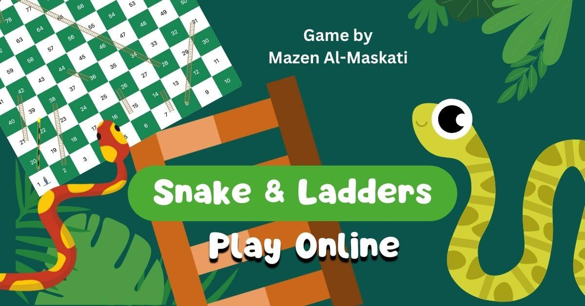

# Snakes and Ladders Game

Snakes and Ladders is a fun and simple game of chance that is enjoyed by people of all ages. The game is played on a board with 100 numbered squares. Each square has a ladder or a snake on it. Players take turns rolling a die and moving their piece along the board. If they land on a square with a ladder, they climb up the ladder to the next square. If they land on a square with a snake, they slide down the snake to the next square. The first player to reach the 100th square wins the game.

This is a simple yet engaging Snakes and Ladders game created using HTML, CSS and JavaScript. The game features a colorful and interactive board, simple animation and a clear user interface. Players can choose to roll a dice or two, navigate the board, and experience the thrill of climbing ladders or sliding down snakes.

## How to play

Player 1 (Human) vs. Player 2 (Human)

1. After loading the page the 2 Players need to decide on who goes first.
2. Before starting the game the players can decide to play with 1 die or 2 dice using the toggle button under the Start New Game Button.
3. Click on the Green "Start New Game" Button
4. The 2 Players have the choice to use the Trackpad/mouse to click on the Blue button to roll the dice per play or alternatively can use the keyboard buttons: SPACEBAR for Player 1 & ENTER button for Player 2.
5. Players will test their luck to tackle the board. If a player stops on a box with a ladder bottom end they will move up automatically to where the ladder finishes. Similarly if any of the players stop on a box with a Snake head touching they will fall down to the box where the end tip of the snake tail touches.
6. In order to win a player needs to stop on Box 100. If a player rolls the dice with more numbers towars landing on Box 100 they will miss their turn and a move is counted.
7. Once a winning position has been reached by either players the game can be reset using the reset button or by refreshing the page.

## Play Demo

2-Player Snakes & Ladder Game

DEMO: https://mobelmedia.com/demo/snakes/

## Features

* Colorful game board design. This game can be played on mobile as a PWA.
* Simple snake animations and quick dice rolls with logged Player movements.
* Clear user interface with easy-to-understand instructions.
* The classic Snakes and Ladders rules apply: The first Player to reach the 100 Box is the winner.
* Additional Score Rating System for advanced play

## Under the hood

* HTML: Structure and content of the game
* Bootstrap 5.3 (CSS + JS + ICONS)
* CSS: Styling and layout of the game elements
* Google Fonts
* JavaScript: Game logic and interactions
* Audio(s): https://pixabay.com/ (royalty-free sound effects)
* Icon(s): https://www.flaticon.com/ (Free Options)

## Installation

To play the game, simply clone this repository to your local machine and open the index.html file in a web browser.

## Contributing

Please feel free to fork the repository, make your changes, and submit a pull request. I will review your contributions and merge them into the main branch if they are deemed appropriate.

## Credits

This game was created during General Assembly - Software Engineering Immersive Course (Bahrain)
November 2023

Have fun making games!

Please enjoy this game and let me know if you have any feedback or suggestions. 

Game D&D by Mazen Almaskati: https://mmaskati.com

Thank You!
